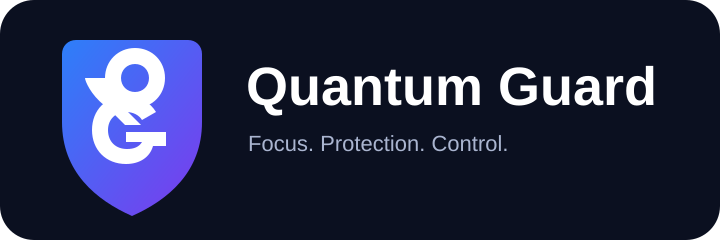

<p align="center">
  
</p>

<p align="center">
  <strong>Focus. Protection. Control.</strong><br>
  Quantum Guard is a Windows focused application control and device management project designed around local enforcement, cloud managed policies, and secure administrator control.
</p>

<p align="center">
  
  
</p>

## Quantum Guard

Quantum Guard is being developed as a central control platform for application restrictions, focus sessions, schedules, website protection, download controls, device enrollment, and administrator managed policies.

The project is currently in active development. The connected cloud control plane includes device-specific roles, profile context, heartbeat, remote commands and hardened account control. The source repository is private. The 1.11 development line is migrating update/package distribution to signed Cloudflare manifests and private R2 delivery. Production update publication remains disabled until Windows installer, rollback and trusted-code-signing QA are complete.

## Core capabilities

| Area | Current direction |
| --- | --- |
| Application control | Protect selected Windows applications and use allow or deny rules |
| Focus | Restrict distractions with configurable app policies and schedules |
| Web protection | Block selected sites, categories, advertising domains, and trackers |
| Download Guard | Restrict or quarantine selected download types |
| Scheduling | Apply app, focus, and after hours rules by time |
| Cloud control | Supabase backed identities, organizations, devices, policies, and commands |
| Device enrollment | Organization membership plus pairing code enrollment |
| Administration | Separate administrator and managed client experiences |
| Updates | Signed Cloudflare manifest checks, verified package downloads, versioned installer and rollback work in the current development line |

## Development preview

Quantum Guard 1.11 preview builds are still under controlled QA. The private source repository is not a public download channel, and the production Cloudflare update feed is intentionally unpublished.

Before using a preview build on an important computer:

1. Back up your Quantum Guard configuration.
2. Review the matching build notes and test report.
3. Verify the published SHA-256 for the exact preview package.
4. Test the build on a non-critical device first.

## Cloud architecture

Quantum Guard uses Supabase as its cloud control plane for:

* Google authenticated profiles
* Organizations and memberships
* Managed devices
* Role based access
* Device policies
* Pairing codes
* Remote commands
* Activity events
* Release/update metadata


## Administrator and client roles

Quantum Guard is designed so that identity and device authority are separate concepts.

An administrator account may manage devices and policies where authorized. A client device receives the policy assigned to it and must not gain administrator privileges simply because a user signs in.

The effective access design is based on:

```
Google identity
      ↓
Quantum Guard profile
      ↓
Organization membership
      ↓
Current device
      ↓
Device role and permissions
      ↓
Assigned policy
```

## Releases

The source repository is private and is no longer the public application-distribution path.

Quantum Guard 1.11 is moving release delivery to Cloudflare Worker + private R2 with signed manifests. Production release publication is currently held while trusted Authenticode signing and live Windows installer/rollback acceptance testing are completed.

Do not distribute internal preview packages as production releases.

## Security

Security issues should not be posted publicly with sensitive reproduction details. See [SECURITY.md](SECURITY.md) for reporting guidance.

## Support and feedback

For bugs during private development, use the repository issue templates when you have repository access so reports include the Windows version, Quantum Guard version, reproduction steps, and screenshots where useful.

## Development status

Quantum Guard is under active development. Features, data models, UI structure, and cloud behavior may change before a stable release.

Copyright © 2026 Quantum Guard.
